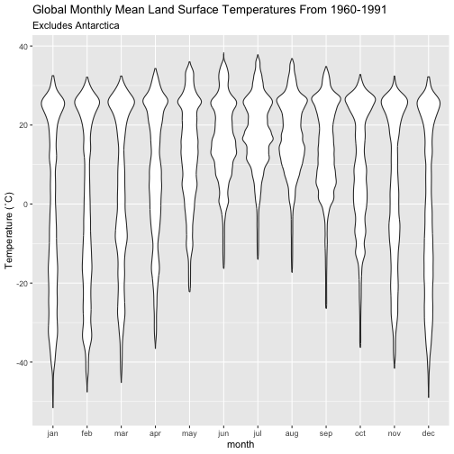

## Introduction to _getCRUCLdata_

The _getCRUCLdata_ package provides functions that automate importing CRU CL v. 2.0 climatology data into R, facilitate the calculation of minimum temperature and maximum temperature, and formats the data into a
[tidy data frame](http://vita.had.co.nz/papers/tidy-data.html) as a `tibble::tibble()`
object or a [`list()`](https://www.rdocumentation.org/packages/base/versions/3.4.0/topics/list)
of [`raster::stack()`](https://www.rdocumentation.org/packages/raster/versions/2.5-8/topics/stack)
objects for use in an R session.

CRU CL v. 2.0 data are a gridded climatology of 1961-1990 monthly means released in 2002 and cover all land areas (excluding Antarctica) at 10 arcminutes (0.1666667 degree) resolution.
For more information see the description of the data provided by the University of East Anglia Climate Research Unit (CRU), <https://crudata.uea.ac.uk/cru/data/hrg/tmc/readme.txt>.

## Changes to original CRU CL v. 2.0 data

This package automatically converts elevation values from kilometres to metres.

This package crops all spatial outputs to an extent of ymin = -60, ymax = 85, xmin = -180, xmax = 180. Note that the original wind data include land area for parts of Antarctica.

# Using _getCRUCLdata_

Logical arguments are used to specify the climatology elements to retrieve and parse.
All arguments default to `FALSE`.
The `create_CRU_*()` functions require an additional parameter, `dsn` to be provided that states where the files are locally stored.
The arguments for selecting the climatology elements for importing are:

- **pre** Logical. Fetch precipitation (millimetres/month) from server and return in the data?

- **pre_cv** Logical. Fetch cv of precipitation (percent) from server and return in the data?

- **rd0** Logical. Fetch wet-days (number days with >0.1 millimetres rain per month) and return in the data?

- **dtr** Logical. Fetch mean diurnal temperature range (degrees Celsius) and return it in the data?

- **tmp** Logical. Fetch temperature (degrees Celsius) and return it in the data?

- **tmn** Logical. Calculate minimum temperature values (degrees Celsius) and return it in the data?

- **tmx** Logical. Calculate maximum temperature (degrees Celsius) and return it in the data?

- **reh** Logical. Fetch relative humidity and return it in the data?

- **sunp** Logical. Fetch sunshine, percent of maximum possible (percent of day length) and return it in data?

- **frs** Logical. Fetch ground-frost records (number of days with ground-frost per month) and return it in data?

- **wnd** Logical. Fetch 10m wind speed (metres/second) and return it in the data?

- **elv** Logical. Fetch elevation (and convert to metres from kilometres) and return it in the data?

- **dsn** *For `create_CRU_stack()`* and *`create_CRU_df()`* only.
Local file path where CRU CL v. 2.0 .dat.gz files are located.

### Creating tidy data frames for use in R

The `get_CRU_df()` function automates the download process and creates tidy data frames as a `tibble::tibble()` of the CRU CL v. 2.0 climatology elements.


```r
library(getCRUCLdata)

CRU_data <- get_CRU_df(pre = TRUE,
                       pre_cv = TRUE,
                       rd0 = TRUE,
                       tmp = TRUE,
                       dtr = TRUE,
                       reh = TRUE,
                       tmn = TRUE,
                       tmx = TRUE,
                       sunp = TRUE,
                       frs = TRUE,
                       wnd = TRUE,
                       elv = TRUE)

CRU_data
#> # A tibble: 6,795,150 x 15
#>      lat   lon month   dtr   frs   pre pre_cv   rd0   reh   sun   tmp   wnd   elv   tmx   tmn
#>    <dbl> <dbl> <fct> <dbl> <dbl> <dbl>  <dbl> <dbl> <dbl> <dbl> <dbl> <dbl> <dbl> <dbl> <dbl>
#>  1  30.9  35.4 <NA>   NA    NA    NA     NA    NA    NA    NA    NA    NA    -260 NA    NA   
#>  2  31.1  35.4 <NA>   NA    NA    NA     NA    NA    NA    NA    NA    NA    -361 NA    NA   
#>  3  31.2  35.4 <NA>   NA    NA    NA     NA    NA    NA    NA    NA    NA    -336 NA    NA   
#>  4  31.4  35.4 <NA>   NA    NA    NA     NA    NA    NA    NA    NA    NA    -284 NA    NA   
#>  5  31.8  35.6 <NA>   NA    NA    NA     NA    NA    NA    NA    NA    NA    -248 NA    NA   
#>  6  31.9  35.6 <NA>   NA    NA    NA     NA    NA    NA    NA    NA    NA    -210 NA    NA   
#>  7 -59.1 -26.6 jan     2.3  18.7 105.    35.2  17.1  88.6   9.4   0.2   6.4   193  1.35 -0.95
#>  8 -58.4 -26.4 jan     2.5  18.5 107.    36.2  17.2  88.5   9.9   0.4   6.4   239  1.65 -0.85
#>  9 -58.4 -26.2 jan     2.4  18.4 106.    36.2  17.1  88.5  10     0.6   6.4   194  1.8  -0.6 
#> 10 -55.9 -67.2 jan     7.6   8    73.1   44.1  13.3  80.7  34.3   8     5      64 11.8   4.2 
#> # … with 6,795,140 more rows
```

Perhaps you only need one or two elements, it is easy to create a tidy data frame of mean temperature only.


```r
t <- get_CRU_df(tmp = TRUE)

t
#> # A tibble: 6,795,144 x 4
#>      lat   lon month   tmp
#>    <dbl> <dbl> <fct> <dbl>
#>  1 -59.1 -26.6 jan     0.2
#>  2 -58.4 -26.2 jan     0.6
#>  3 -58.4 -26.4 jan     0.4
#>  4 -55.9 -67.2 jan     8  
#>  5 -55.8 -67.2 jan     8.2
#>  6 -55.8 -67.4 jan     8  
#>  7 -55.8 -67.6 jan     8.4
#>  8 -55.6 -67.4 jan     8.3
#>  9 -55.6 -67.6 jan     8.6
#> 10 -55.6 -68.1 jan     8.2
#> # … with 6,795,134 more rows
```

#### Plotting data from the tidy dataframe

Now that we have the data, we can plot it easily using _ggplot2_ and the _viridis_ package for the colour scale.


```r
library(ggplot2)
library(viridis)

ggplot(data = t, aes(x = lon, y = lat, fill = tmp)) +
  geom_tile() +
  scale_fill_viridis(option = "inferno") +
  coord_quickmap() +
  ggtitle("Global Mean Monthly Temperatures 1961-1990") +
  facet_wrap( ~ month, nrow = 4)
```


We can also generate a violin plot of the same data to visualise how the temperatures change throughout the year.


```r
ggplot(data = t, aes(x = month, y = tmp)) +
  geom_violin() +
  ylab("Temperature (˚C)") +
  labs(title = "Global Monthly Mean Land Surface Temperatures From 1960-1991",
       subtitle = "Excludes Antarctica")
```



#### Saving the tidy `data.frame` as a CSV (comma separated values file) locally

Save the resulting tidy `data.frame` to local disk as a comma separated (CSV)
file to local disk, using _data.table_'s `fwrite()`.


```r
fwrite(x = t, file = "~/CRU_tmp.csv")
```

### Creating raster stacks for use in R and saving for use in another GIS

For working with spatial data, _getCRUCLdata_ provides a function that create lists of _raster_ stacks of the data.

The `get_CRU_stack()` functions provide similar functionality to `get_CRU_df()`, but rather than returning a tidy data frame, it returns a list of `raster::stack()` objects for use in an R session.

The `get_CRU_stack()` function automates the download process and creates a `raster::stack()` object of the CRU CL v. 2.0 climatology elements.
Illustrated here is creating a `raster::stack()` of all CRU CL v. 2.0 climatology elements available.


```r
CRU_stack <- get_CRU_stack(
  pre = TRUE,
  pre_cv = TRUE,
  rd0 = TRUE,
  tmp = TRUE,
  dtr = TRUE,
  reh = TRUE,
  tmn = TRUE,
  tmx = TRUE,
  sunp = TRUE,
  frs = TRUE,
  wnd = TRUE,
  elv = TRUE
)

CRU_stack
#> $dtr
#> class      : RasterBrick 
#> dimensions : 870, 2160, 1879200, 12  (nrow, ncol, ncell, nlayers)
#> resolution : 0.1666667, 0.1666667  (x, y)
#> extent     : -180, 180, -60, 85  (xmin, xmax, ymin, ymax)
#> crs        : +proj=longlat +datum=WGS84 +no_defs 
#> source     : memory
#> names      :  jan,  feb,  mar,  apr,  may,  jun,  jul,  aug,  sep,  oct,  nov,  dec 
#> min values :  2.3,  2.1,  2.2,  2.3,  1.8,  2.5,  2.8,  2.4,  2.2,  2.8,  2.6,  2.0 
#> max values : 22.7, 23.1, 23.5, 24.0, 24.0, 25.2, 25.8, 25.6, 25.5, 22.6, 22.9, 21.9 
#> 
#> 
#> $elv
#> class      : RasterLayer 
#> dimensions : 870, 2160, 1879200  (nrow, ncol, ncell)
#> resolution : 0.1666667, 0.1666667  (x, y)
#> extent     : -180, 180, -60, 85  (xmin, xmax, ymin, ymax)
#> crs        : +proj=longlat +datum=WGS84 +no_defs 
#> source     : memory
#> names      : elv 
#> values     : -361, 6486  (min, max)
#> 
#> 
#> $frs
#> class      : RasterBrick 
#> dimensions : 870, 2160, 1879200, 12  (nrow, ncol, ncell, nlayers)
#> resolution : 0.1666667, 0.1666667  (x, y)
#> extent     : -180, 180, -60, 85  (xmin, xmax, ymin, ymax)
#> crs        : +proj=longlat +datum=WGS84 +no_defs 
#> source     : memory
#> names      :  jan,  feb,  mar,  apr,  may,  jun,  jul,  aug,  sep,  oct,  nov,  dec 
#> min values :    0,    0,    0,    0,    0,    0,    0,    0,    0,    0,    0,    0 
#> max values : 31.0, 28.3, 31.0, 30.0, 31.0, 30.0, 31.0, 31.0, 30.0, 31.0, 30.0, 31.0 
#> 
#> 
#> $pre
#> class      : RasterBrick 
#> dimensions : 870, 2160, 1879200, 24  (nrow, ncol, ncell, nlayers)
#> resolution : 0.1666667, 0.1666667  (x, y)
#> extent     : -180, 180, -60, 85  (xmin, xmax, ymin, ymax)
#> crs        : +proj=longlat +datum=WGS84 +no_defs 
#> source     : memory
#> names      :    jan,    feb,    mar,    apr,    may,    jun,    jul,    aug,    sep,    oct,    nov,    dec, pre_cv_jan, pre_cv_feb, pre_cv_mar, ... 
#> min values :    0.0,    0.0,    0.0,    0.0,    0.0,    0.0,    0.0,    0.0,    0.0,    0.0,    0.0,    0.0,        0.0,      -10.5,        5.8, ... 
#> max values :  910.1,  824.3,  727.3,  741.3, 1100.0, 2512.6, 2505.5, 1799.4,  849.8,  851.6,  843.7,  733.3,      496.2,      495.5,      482.0, ... 
#> 
#> 
#> $rd0
#> class      : RasterBrick 
#> dimensions : 870, 2160, 1879200, 12  (nrow, ncol, ncell, nlayers)
#> resolution : 0.1666667, 0.1666667  (x, y)
#> extent     : -180, 180, -60, 85  (xmin, xmax, ymin, ymax)
#> crs        : +proj=longlat +datum=WGS84 +no_defs 
#> source     : memory
#> names      :  jan,  feb,  mar,  apr,  may,  jun,  jul,  aug,  sep,  oct,  nov,  dec 
#> min values :    0,    0,    0,    0,    0,    0,    0,    0,    0,    0,    0,    0 
#> max values : 31.0, 28.2, 31.0, 30.0, 30.7, 30.0, 31.0, 31.0, 29.1, 28.4, 28.5, 30.3 
#> 
#> 
#> $reh
#> class      : RasterBrick 
#> dimensions : 870, 2160, 1879200, 12  (nrow, ncol, ncell, nlayers)
#> resolution : 0.1666667, 0.1666667  (x, y)
#> extent     : -180, 180, -60, 85  (xmin, xmax, ymin, ymax)
#> crs        : +proj=longlat +datum=WGS84 +no_defs 
#> source     : memory
#> names      :   jan,   feb,   mar,   apr,   may,   jun,   jul,   aug,   sep,   oct,   nov,   dec 
#> min values :  18.4,  14.6,  13.5,  13.4,  15.5,  10.2,  10.8,  10.1,  11.0,  14.2,  19.0,  19.7 
#> max values : 100.0, 100.0, 100.0, 100.0,  96.9,  95.1,  96.9,  97.1,  95.5, 100.0, 100.0, 100.0 
#> 
#> 
#> $sun
#> class      : RasterBrick 
#> dimensions : 870, 2160, 1879200, 12  (nrow, ncol, ncell, nlayers)
#> resolution : 0.1666667, 0.1666667  (x, y)
#> extent     : -180, 180, -60, 85  (xmin, xmax, ymin, ymax)
#> crs        : +proj=longlat +datum=WGS84 +no_defs 
#> source     : memory
#> names      :  jan,  feb,  mar,  apr,  may,  jun,  jul,  aug,  sep,  oct,  nov,  dec 
#> min values :  0.0,  0.0,  3.3,  4.3,  8.1,  6.6,  5.3,  8.4,  4.5,  0.8,  0.0,  0.0 
#> max values : 92.8, 93.0, 90.2, 93.1, 94.0, 98.9, 98.8, 98.8, 99.1, 95.8, 94.6, 93.1 
#> 
#> 
#> $tmp
#> class      : RasterBrick 
#> dimensions : 870, 2160, 1879200, 12  (nrow, ncol, ncell, nlayers)
#> resolution : 0.1666667, 0.1666667  (x, y)
#> extent     : -180, 180, -60, 85  (xmin, xmax, ymin, ymax)
#> crs        : +proj=longlat +datum=WGS84 +no_defs 
#> source     : memory
#> names      :   jan,   feb,   mar,   apr,   may,   jun,   jul,   aug,   sep,   oct,   nov,   dec 
#> min values : -51.6, -47.6, -45.2, -36.6, -22.2, -16.3, -14.0, -17.3, -26.4, -36.3, -41.6, -49.0 
#> max values :  32.5,  32.1,  32.4,  34.3,  36.0,  38.3,  37.8,  36.8,  34.8,  32.8,  32.4,  32.2 
#> 
#> 
#> $wnd
#> class      : RasterBrick 
#> dimensions : 870, 2160, 1879200, 12  (nrow, ncol, ncell, nlayers)
#> resolution : 0.1666667, 0.1666667  (x, y)
#> extent     : -180, 180, -60, 85  (xmin, xmax, ymin, ymax)
#> crs        : +proj=longlat +datum=WGS84 +no_defs 
#> source     : memory
#> names      : jan, feb, mar, apr, may, jun, jul, aug, sep, oct, nov, dec 
#> min values : 0.1, 0.1, 0.3, 0.4, 0.3, 0.2, 0.3, 0.4, 0.5, 0.4, 0.2, 0.2 
#> max values : 9.8, 9.6, 9.4, 9.0, 8.7, 8.6, 9.1, 9.3, 9.3, 9.7, 9.6, 9.4 
#> 
#> 
#> $tmn
#> class      : RasterBrick 
#> dimensions : 870, 2160, 1879200, 12  (nrow, ncol, ncell, nlayers)
#> resolution : 0.1666667, 0.1666667  (x, y)
#> extent     : -180, 180, -60, 85  (xmin, xmax, ymin, ymax)
#> crs        : +proj=longlat +datum=WGS84 +no_defs 
#> source     : /private/var/folders/1q/045gnpqd7dnfgzshmdn8hshw0000gp/T/Rtmp4VtMtp/raster/r_tmp_2020-10-26_111004_18359_15367.grd 
#> names      : layer.1, layer.2, layer.3, layer.4, layer.5, layer.6, layer.7, layer.8, layer.9, layer.10, layer.11, layer.12 
#> min values :  -55.05,  -52.95,  -48.75,  -41.35,  -28.00,  -21.40,  -18.75,  -22.55,  -31.45,   -40.60,   -45.75,   -52.50 
#> max values :   26.30,   26.25,   27.40,   27.50,   30.00,   30.65,   30.60,   30.40,   28.75,    26.95,    25.90,    26.55 
#> 
#> 
#> $tmx
#> class      : RasterBrick 
#> dimensions : 870, 2160, 1879200, 12  (nrow, ncol, ncell, nlayers)
#> resolution : 0.1666667, 0.1666667  (x, y)
#> extent     : -180, 180, -60, 85  (xmin, xmax, ymin, ymax)
#> crs        : +proj=longlat +datum=WGS84 +no_defs 
#> source     : /private/var/folders/1q/045gnpqd7dnfgzshmdn8hshw0000gp/T/Rtmp4VtMtp/raster/r_tmp_2020-10-26_111006_18359_67835.grd 
#> names      : layer.1, layer.2, layer.3, layer.4, layer.5, layer.6, layer.7, layer.8, layer.9, layer.10, layer.11, layer.12 
#> min values :  -48.20,  -43.35,  -41.65,  -32.45,  -17.55,  -11.50,  -10.85,  -12.30,  -21.65,   -32.05,   -37.55,   -45.50 
#> max values :   39.70,   38.40,   40.25,   41.85,   43.60,   45.95,   45.70,   44.85,   42.35,    39.50,    39.20,    39.90
```

The `create_CRU_stack()` function works in the same way with only one minor difference.
You must supply the location of the files on the local disk (`dsn`) that you wish to import.


```r
t <- create_CRU_stack(tmp = TRUE, dsn = "~/Downloads")
```

#### Plotting raster stacks of tmin and tmax

Because the stacks are in a `list()`, we need to access each element of the list individually to plot them, that's what the `[[1]]` or `[[2]]` is, the first or second element of the list.
Here using `[[7]]` we will plot the monthly average minimum temperature for all twelve months.


```r
library(raster)

plot(CRU_stack[[7]])
```

To plot only one month from the stack is also possible. Here we plot maximum temperature for July.
Note that we use indexing `[[2]]` as before but append a `$jul` to the object.
This is the name of the layer in the `raster::stack()`.
So, we are telling R to plot the second object in the `CRU_stack` list, which is `tmx` and from that raster stack, plot only the layer for July.


```r
plot(t[[8]]$jul)
```

#### Saving raster objects to local disk

The raster stack objects can be saved to disk as geotiff files (others are available, see help for `raster::writeRaster()` and `raster::writeFormats()` for more options) on the `Data` directory with a tmn or tmx prefix to the month for a file name.


```r
library(raster)

dir.create(file.path("~/Data"), showWarnings = FALSE)
writeRaster(
  t$tmn,
  filename = file.path("~/Data/tmn_", names(t$tmn)),
  bylayer = TRUE,
  format = "GTiff"
)

writeRaster(
  t$tmx,
  filename = file.path("~/Data/tmx_", names(t$tmn)),
  bylayer = TRUE,
  format = "GTiff"
)
```

# CRU CL v. 2.0 reference and abstract

Mark New (1,*), David Lister (2), Mike Hulme (3), Ian Makin (4)
A high-resolution data set of surface climate over global land areas Climate Research, 2000, Vol 21, pg 1-25
(1) School of Geography and the Environment, University of Oxford,
    Mansfield Road, Oxford OX1 3TB, United Kingdom
(2) Climatic Research Unit, and (3) Tyndall Centre for Climate Change Research,
    both at School of Environmental Sciences, University of East Anglia,
    Norwich NR4 7TJ, United Kingdom
(4) International Water Management Institute, PO Box 2075, Colombo, Sri Lanka

**ABSTRACT:** We describe the construction of a 10-minute latitude/longitude
data set of mean monthly surface climate over global land areas, excluding
Antarctica. The climatology includes 8 climate elements - precipitation, wet-day
frequency, temperature, diurnal temperature range, relative humidity,sunshine
duration, ground frost frequency and windspeed - and was interpolated from a
data set of station means for the period centred on 1961 to 1990. Precipitation
was first defined in terms of the parameters of the Gamma distribution, enabling
the calculation of monthly precipitation at any given return period. The data
are compared to an earlier data set at 0.5 degrees latitude/longitude resolution
and show added value over most regions. The data will have many applications in
applied climatology, biogeochemical modelling, hydrology and agricultural
meteorology and are available through the School of Geography Oxford
(http://www.geog.ox.ac.uk), the International Water Management Institute
"World Water and Climate Atlas" (https://www.iwmi.cgiar.org/) and the Climatic
Research Unit (http://www.cru.uea.ac.uk).
